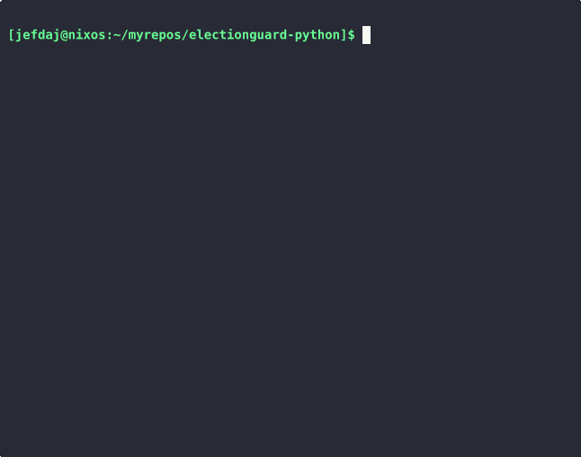

======================

This is my fork for use in [the Cardano integration](https://github.com/jefdaj/electionguard-cardano).

Main changes:

- [Fixed a `poetry.lock` bug](https://github.com/jefdaj/electionguard-python/commit/2d2f9e0901b70ae2adea09b749dd03757395b977)
- Added a [Dockerfile](./Dockerfile) along with [build](./docker-build.sh), [test](./docker-test.sh), and [hack](./docker-shell.sh) scripts
- Published [the Docker image](https://ghcr.io/jefdaj/electionguard-python)
- Updated to current upstream code as of 2026-07-06
- Packaged with Nix
- Have not updated the Docker image for current code yet

# New Nix Build

```bash
# build Python lib + binaries
nix build
```

```bash
# dev env that works with Makefile
nix develop
make all
```

```bash
# build binary and run eg e2e tests with it
nix flake check
```

# Old Docker Build

```bash
./docker-build.sh
```



## Test

```bash
./docker-test.sh
```


## Hack

Substitute your system package manager for Nix here if you want.

The Docker shell bind mounts the source code + data dirs,
so you can edit from the host system and work with sample files easily.

Run the docker compose make commands in a host nix-shell.

```bash
nix-shell -p docker-compose gnumake python3
make start-db
```

Run the other make commands in the electionguard-python container.

```bash
nix-shell -p docker-compose
./docker-shell.sh
make eg-e2e-simple-election
```


